<div>
  
  <h2 style="text-align: center; margin: 0; margin-top: 14px;">nmDatePicker</h2>
</div>

nmDatePicker is a modern and highly customizable Angular date picker library with inclusive functionality.

### Table of content

1. [Installation](#installation)
2. [API quick guide](#api-quick-guide)
2. [API docs](#api-docs)
4. [Custom templates](#custom-templates)
5. [Interfaces](#interfaces) 
        1. [nmDateInterface](#nmDateInterface) 
        2. [nmWeekdayInterface](#nmWeekdayInterface)
6. [Directives](#directives) 
        1. [Cancel action directive](#cancel-action-directive) 
        2. [nmTrigger directive](#nmTrigger-directive)
7. [Services](#services) 
        1. [Action notifier service](#action-notifier-service)
8. [License](#license)

### Installation {#installation}

### API quick guide table {#api-quick-guide}

\* Click the property names for quick navigation.

| Property | Description | Type | Default Value |
| ----------- | ----------- | ----------- | ----------- |
| [`[nmDisplayMethod]`](#nmDisplayMethod) | sets the display method | `'inline' \| 'dropdown'` | `'dropdown'` |
| [`[nmPickerMode]`](#nmPickerMode) | sets the date picker operation mode | `'date' \| 'month' \| 'year'` | `'date'` |
| [`[nmDisabled]`](#nmDisabled) | sets the disabled state of the picker | `boolean` | `false` |
| [`[nmTheme]`](#nmTheme) | sets the color theme | `'light' \| 'dark'` | `'light'` |
| [`[nmMarkWeekends]`](#nmMarkWeekends) | enables the highlight of the weekends | `boolean` | `false` |
| [`[nmWeekendDisplayMethod]`](#nmWeekendDisplayMethod) | sets the color theme | `'start' \| 'end' \| 'split'` | `'end'` |
| [`[nmLanguage]`](#nmLanguage) | sets the picker locale | `NmLocalizationLanguageTypes` | `'en'` |
| [`[nmCustomLocalization]`](#nmCustomLocalization) | pass in a custom localization object | `NmLocalizationType` |  |
| [`[nmDisabledDates]`](#nmDisabledDates) | used to specify disabled dates | `(date: Date) => boolean` |  |
| [`[nmHighlightedDates]`](#nmHighlightedDates) | used to specify highlighted dates | `(date: Date, nmDateObject: NmDateInterface) => boolean)` |  |
| [`[nmMinDate]`](#nmMinDate) | sets the minimum limit of available dates | `Date \| null` | `null` |
| [`[nmMaxDate]`](#nmMaxDate) | sets the maximum limit of available dates | `Date \| null` | `null` |
| [`[nmRangeSelection]`](#nmRangeSelection) | enables the range selection mode | `boolean` | `false` |
| [`[nmMultiDateSelect]`](#nmMultiDateSelect) | enables the multi-date selection mode | `boolean` | `false` |
| [`[nmStatus]`](#nmStatus) | sets the date picker status | `'default' \| 'warning' \| 'error'` | `'default'` |
| [`[nmSelectorCustomLabel]`](#nmSelectorCustomLabel) | sets a custom label for the dropdown selector | `string \| null` | `null` |
| [`[nmSelectorDateFormat]`](#nmSelectorDateFormat) | sets the picker selector date format | `string \| null` | `null` |
| [`[nmAllowClear]`](#nmAllowClear) | enables the clear button on the dropdown selector | `boolean` | `true` |

### API docs {#api-docs}

#### nmDisplayMethod {#nmDisplayMethod} 

`nmDisplayMethod: "inline" | "dropdown"`
Used to select one of the 2 supported display methods.
By default it is set to 'dropdown'
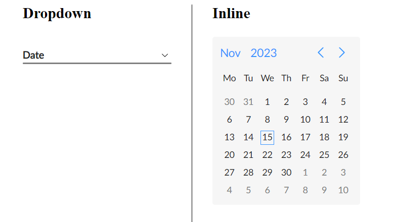

#### nmPickerMode {#nmPickerMode} 

`nmPickerMode: "date" | "month" | "year"`
Used to pass in the date picker operation mode.
The operation modes work in a hierarchy.

1. date
2. month
3. year

This means that by passing an operation mode, the date picker will originally display in the set mode, and will be limited to that mode, but will still have access to the modes lower in the hierarchy.
**_\*Example:_** If you pass in ‘month’, the date picker will display in ‘month’ mode, but you will still be able to switch to the ‘year’ mode. (\* in default layout you will have no options to switch to the ‘date’ mode.
More about [custom layouts](#custom-templates))

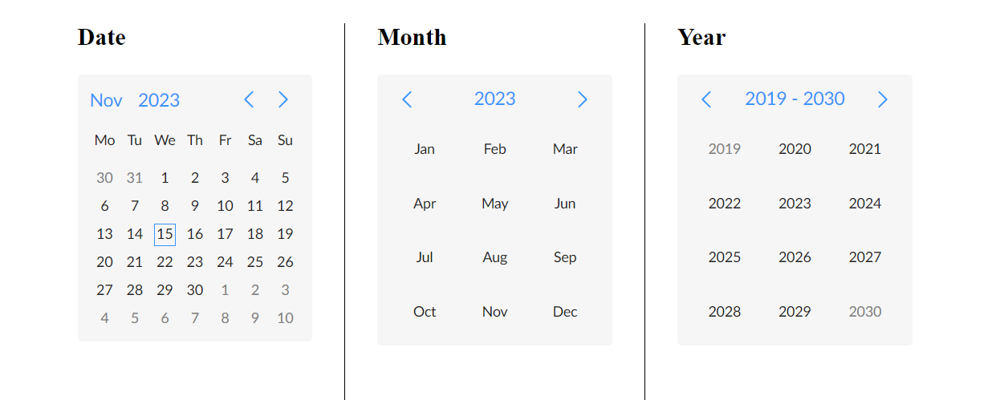

Controls in the date picker header panel are used to switch between modes.

By default the date picker uses the ‘date’ mode, thus it has access to all 3 operation modes.

#### nmDisabled {#nmDisabled}

`nmDisabled: boolean`
A boolean value that sets the disabled state of the whole picker

#### nmTheme {#nmTheme}

`nmTheme: ‘light’ | ‘dark’`
Used to switch between light and dark themes.
By default the date picker uses the light theme variation.
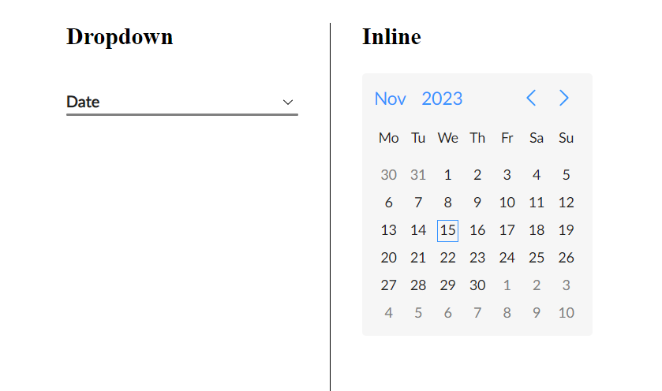
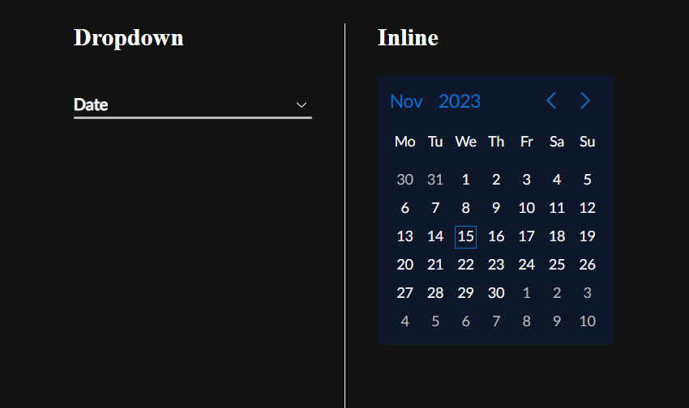

\* Here are the default color variables used in the library

```scss
nm-date-picker {
  /* common colors */
  --nm-datepicker-white: #ffffff;
  --nm-datepicker-text-color-dark: #202020;
  --nm-datepicker-color-danger: #ff4d4f;
  --nm-datepicker-holiday-color: #ff4d4f;
  --nm-datepicker-highlight-color: #ff4d4f;

  /* light colors */
  --nm-datepicker-primary-color: #3794ff;
  --nm-datepicker-warning-color: #faad14;
  --nm-datepicker-error-color: #ff2d31;
  --nm-datepicker-inrange-cell-default-color: #e6f7ff;
  --nm-datepicker-inrange-cell-error-color: #ffe6e6;
  --nm-datepicker-inrange-cell-warning-color: #fff5e6;
  --nm-datepicker-text-color: #202020;
  --nm-datepicker-background-color: #f6f6f6;
  --nm-datepicker-hover-background-color: #0000000d;
  --nm-datepicker-text-color-disabled: #dedede;
  --nm-datepicker-color-danger-disabled: #ffbcbc;
  --nm-datepicker-holiday-color-disabled: #ffbcbc;
  --nm-datepicker-text-color-secondary: #808080;
  --nm-datepicker-disabled: grayscale(0.4) opacity(0.7);
}

[nm-theme="dark"] {
  --nm-datepicker-primary-color: #0672cb;
  --nm-datepicker-warning-color: #e09705;
  --nm-datepicker-error-color: #cd0003;
  --nm-datepicker-inrange-cell-default-color: #263653;
  --nm-datepicker-inrange-cell-error-color: #532626;
  --nm-datepicker-inrange-cell-warning-color: #534626;
  --nm-datepicker-text-color: #f6f6f6;
  --nm-datepicker-background-color: #0f172a;
  --nm-datepicker-hover-background-color: #ffffff4d;
  --nm-datepicker-text-color-disabled: #76777a;
  --nm-datepicker-color-danger-disabled: #992d2f;
  --nm-datepicker-holiday-color-disabled: #992d2f;
  --nm-datepicker-text-color-secondary: #b8b8b8;
  --nm-datepicker-disabled: grayscale(0.4) opacity(0.9);
}
```

\* You can also reassign color variables for each theme separately, using a css class.

**_Example:_**

```html
<nm-date-picker
  class="custom-date-picker-color"
  [nmTheme]="theme"
  [nmDisplayMethod]="'inline'"
  [(ngModel)]="date"
></nm-date-picker>
```

```scss
/* light mode variables */
.custom-date-picker-color {
  --nm-datepicker-primary-color: #ff37cd;
}

/* dark mode variables */
.custom-date-picker-color[nm-theme="dark"] {
  --nm-datepicker-primary-color: #06b47a;
}
```

**_Result:_**
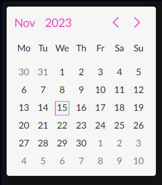 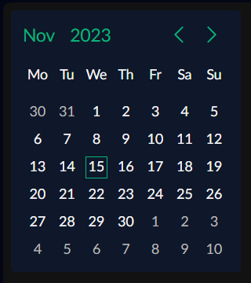

#### nmMarkWeekends {#nmMarkWeekends}

`nmMarkWeekends: boolean`
Used to enable the highlight of the weekends (the default highlight color is red)
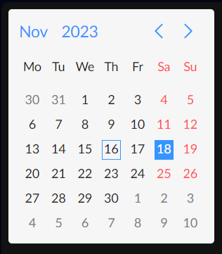

#### nmWeekendDisplayMethod {#nmWeekendDisplayMethod}

`nmWeekendDisplayMethod: 'start' | 'end' | 'split'`
Used to set the display method of weekend days (Saturday and Sunday).
By default the date picker uses the ‘end’ variation.
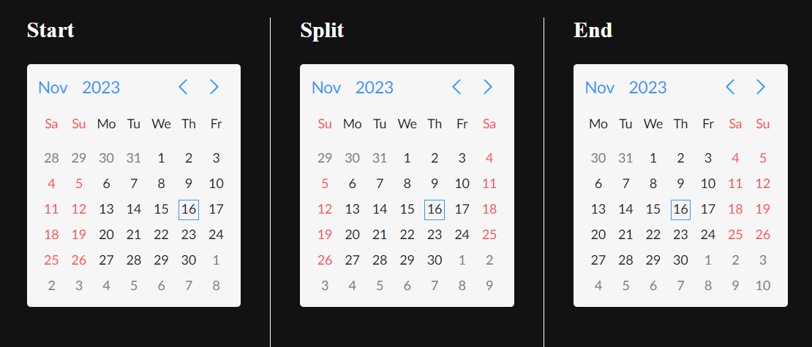

#### nmLanguage {#nmLanguage}

`nmLanguage: NmLocalizationLanguageTypes;`

```ts
type NmLocalizationLanguageTypes = "en" | "ru" | "am" | string;
```

**(\*type NmLocalizationLanguageTypescan be imported from the library)**
Used to set the current locale used on the date picker.
The library has in-build support for 3 languages and you can use them by passing the respective key to the [nmLanguage]:

- English (en) \* used by default
- Russian (ru)
- Armenian (am)

You can also pass in a custom language selector (string), if you are using [nmCustomLocalization](#nmCustomLocalization) to pass in a custom localization object.

#### nmCustomLocalization {#nmCustomLocalization}

`nmCustomLocalization: NmLocalizationType`
Used to pass in a custom localization object following the NmLocalizationType type

```ts
type NmLocalizationType = {
  [key in NmLocalizationLanguageTypes]: {
    WEEKDAY_NAMES_SHORT: string[];
    MONTH_NAMES_SHORT: string[];
    MONTH_NAMES_DECLENSED: string[];
  };
};
```

**\*NmLocalizationType can be imported from the library**

- WEEKDAY_NAMES_SHORT - used for the weekday names in 'date' mode
- MONTH_NAMES_SHORT - used for month names in 'month' mode
- MONTH_NAMES_DECLENSED - used for displaying the selected month name in the date picker selector (display method 'dropdown')

#### nmDisabledDates {#nmDisabledDates}

`nmDisabledDates: (date: Date) => boolean`
Accepts a callback function, that is applied to every date cell in the view
Receives the Date object of the cell, and must return a boolean value based on the evaluation that determines whether the cell is disabled or not.

```ts
private minDateValue: Date = new Date("2023.11.8"); // November 8, 2023
private maxDateValue: Date = new Date("2023.11.22"); // November 22, 2023

disabledDates: (date: Date) => boolean = (date: Date) => {
  return date < this.minDateValue || date > this.maxDateValue;
};
// Dates before the minDateValue and dates after the maxDateValue will be disabled
```

**_Output_**

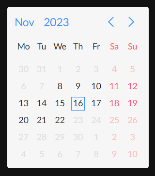

#### nmHighlightedDates {#nmHighlightedDates}

`nmHighlightedDates: (date: Date, nmDateObject: NmDateInterface) => boolean`
Accepts a callback function, that is applied to every date cell in the view.
Receives the Date object of the cell and the nmDate object, and must return a boolean value based on the evaluation that determines whether the cell should be highlighted or not.

```ts
private holidays: Date[] = [
  new Date("12.31.2023"),
  new Date("01.01.2023"),
  new Date("01.02.2023"),
  new Date("01.03.2023"),
  new Date("01.04.2023"),
  new Date("01.05.2023"),
  new Date("01.06.2023"),
  new Date("01.28.2023"),
  new Date("03.08.2023"),
  new Date("05.01.2023"),
  new Date("05.09.2023"),
  new Date("05.28.2023"),
  new Date("05.28.2023"),
  new Date("07.05.2023"),
  new Date("09.21.2023"),
];

public datesHighlightFn: (date: Date) => boolean = (date: Date) => {
  return !!this.holidays.find(
    (holiday) => holiday.getMonth() === date.getMonth() && holiday.getDate() === date.getDate()
  );
}
```

To highlight a specific date in custom colors, you can use the customTextColor and customBackgroundColor properties of the nmDate object to set custom colors.

```ts
public datesHighlightCustomFn: (date: Date, nmDateObject: NmDateInterface) => boolean = (
    date: Date,
    nmDateObject: NmDateInterface
  ) => {
    const isHoliday = !!this.holidays.find(
      (holiday) => holiday.getMonth() === date.getMonth() && holiday.getDate() === date.getDate()
    );
    if (isHoliday) {
      switch (date.getDate()) {
        case 2:
          nmDateObject.customTextColor = "#097255";
          nmDateObject.customBackgroundColor = "#c8e5d0";
          break;
        case 3:
          nmDateObject.customTextColor = "#800080";
          nmDateObject.customBackgroundColor = "#ffc0cb";
          break;
        case 4:
          nmDateObject.customTextColor = "#440ab8";
          nmDateObject.customBackgroundColor = "#d3c8e5";
          break;
        case 5:
          nmDateObject.customTextColor = "#ffffff";
          nmDateObject.customBackgroundColor = "#50c8ff";
          break;
      }
    }
    return isHoliday;
  };
```

**_Result:_**
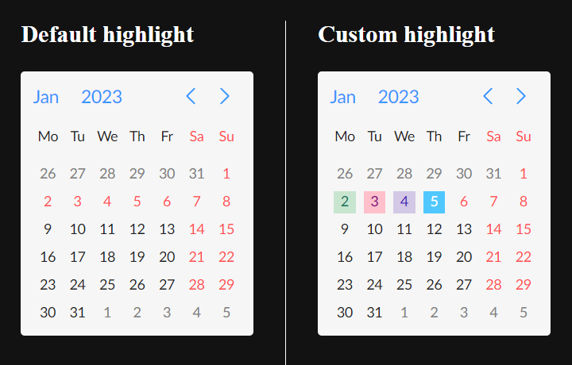


#### nmMinDate {#nmMinDate}

`nmMinDate: Date | null`
Used to set the lower limit of available, selectable dates.
Any date earlier than nmMinDate will be either disabled or not displayed at all (depends on the operation mode)

#### nmMaxDate {#nmMaxDate}

`nmMaxDate: Date | null`
Used to set the upper limit of available, selectable dates.
Any date later than nmMaxDate will be either disabled or not displayed at all (depends on the operation mode)


#### nmRangeSelection {#nmRangeSelection}

`nmRangeSelection: boolean`
A boolean value that activates the range selection mode
\* **The component will output an array of 2 Dates, startDate and endDate**. So you should bind to a [Date, Date] | null, if you are using nmRangeSelection
\* Available for all 3 operation modes.
\* Not compatible with [nmMultiDateSelect](#nmMultiDateSelect).
False - by default

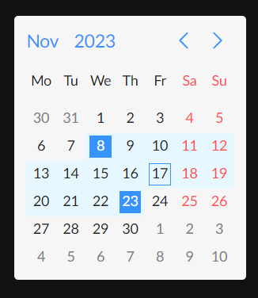

#### nmMultiDateSelect {#nmMultiDateSelect}

`nmMultiDateSelect: boolean`
Activates the multi day selection mode, where you will be able to select multiple dates.
\* **The component will output an array of Dates**. So you should bind to a Date[ ] | null, if you are using nmMultiDateSelect
\* Works with all 3 operation modes.
\* Not compatible with [nmRangeSelection](#nmRangeSelection).
False - by default

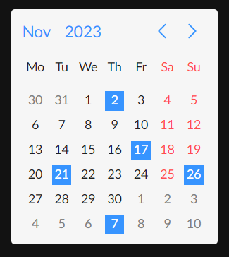


#### nmStatus {#nmStatus}

`nmStatus: 'default' | 'warning' | 'error'`
Used to pass in the date picker status.
\* Works for all 3 operation modes and 2 display methods + in range and multi-date selection modes.

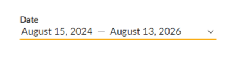
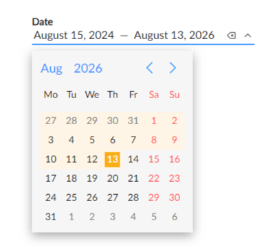
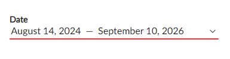
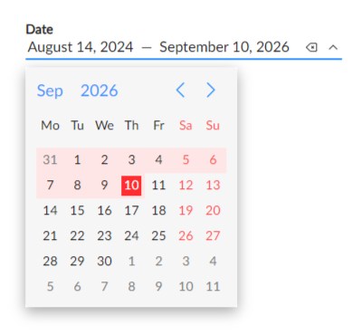


#### nmSelectorCustomLabel {#nmSelectorCustomLabel}

`nmSelectorCustomLabel: string | null`
Used to set a custom label for the picker selector in the 'dropdown' display mode.
By default the value is null, and the word 'Date' (in the specified locale) will be displayed.
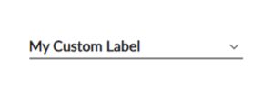


#### nmSelectorDateFormat {#nmSelectorDateFormat}

`nmSelectorDateFormat: string | null`
Pass the date format, that you want the selected date to be displayed in, in the default date picker selector.
Default value = null. Results in: date + month name in the set locale, + year


#### nmAllowClear {#nmAllowClear}

`nmAllowClear: boolean`
A boolean value that makes the clear icon available on the default date picker selector in the 'dropdown' display mode.
Disable if the picker needs to be non-nulluble.
By default is set to true


### Custom templates {#custom-templates}

nmDatePicker is fully customizable. The idea is to have a date picker component that can be customized under any design, while keeping the usual and much needed date picker functionality. And the modular design lets you customize only a single section or all of it.
Custom templates are passed into the component using Angular’s content projection.
nmDatePicker is made up of 6 sections. To customize any of them you should: 
1. insert an `<ng-template>` tag between the opening(`<nm-date-picker>`) and closing(`</nm-date-picker>`) tags,
2. Set the corresponding template reference, so that the component can recognize which section the template is meant to replace,
3. If available, use the template’s implicit variable to access the data, that the component will forward to the template, to construct a custom template. 


### Interfaces {#interfaces}

#### nmDateInterface {#nmDateInterface}

```ts
interface NmDateInterface {
  date: Date; // date value of the cell
  isPrevMarker: boolean; // is true if the date belongs in the previous month (works for 'year' mode as well)
  isNextMarker: boolean; // is true if the date belongs in the next month
  disabled: boolean; // true when the date is disabled
  isToday: boolean; // true if the date value equals to today's
  isSelected: boolean; // true when the date is selected
  isWeekend: boolean; // true when the date is a weekend
  isHighlighted: boolean; // true when highlighted
  displayName?: string; 
  customTextColor: string | undefined; // custom text color of the cell
  customBackgroundColor: string | undefined; // custom background color of the cell
}
```

#### nmWeekdayInterface {#nmWeekdayInterface}

```ts
interface NmWeekdayInterface {
  name: string; // the name of the weekday
  index: number; // the 0 based index of the weekday
  isWeekend: boolean; // bolean value that indicates if a weekday is a weekend
}
```

### Directives {#directives}

#### Cancel action directive {#cancel-action-directive}

#### nmTrigger directive {#nmTrigger-directive}

### Services {#services}

#### Action notifier service {#action-notifier-service}

### Licence {#license}

<a href="https://github.com/NarekMkhoyan/Project_NM-DP/blob/main/LICENSE" target="_blank">MIT</a>
